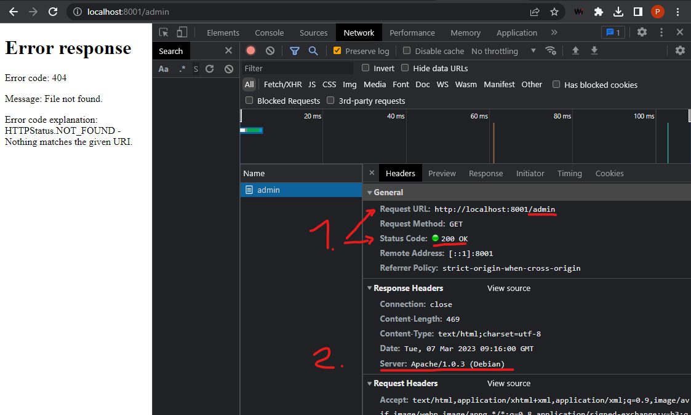

# The `LD_PRELOAD` deception module

The prototype has two capabilities implemented:

* **`response-code` deception:** Overwrites the status code in HTTP responses, e.g., replaces the original status with `200 OK`.
  This modification can further be conditioned to only modify responses to requests for certain URLs.
* **`http-header` deception:** Replaces a header attribute in HTTP responses, e.g., replaces the `Server` header with a seemingly vulnerable `Apache/1.0.3 (Debian)` value.
  Note that the overwritten text will be padded with spaces to the length of the original header field.

## Limitations

The prototype should work for the following applications:

* Applications that rely on `libc` to send and receive network packets
* Applications that send `HTTP/1.0` or `HTTP/1.1` packets
* Applications that are written in Java and Python

## Deployment

Add the compiled `deception.so` to your filesystem and point `LD_PRELOAD` to its path.
See the examples for more. If you need to build the shared library, run the following:

    make

Format your code by running

  make clang

Clean-up the build with

  make clean

### Example with `jdkelley/simple-http-server`

We use `jdkelley/simple-http-server` as representative example for a simple HTTP server, written in Java.
This application just serves any directory mounted to `/serve`. To start the server normally, run:

    docker run --rm -p 80:8000 -v ${PWD}:/serve jdkelley/simple-http-server:latest

To start it with the deception module, run the following:

    docker run --rm -p 80:8000 \
        -v ${PWD}:/serve \
        -v ${PWD}/../bin/mount/deception.so:/opt/deception.so \
        -v ${PWD}/../bin/mount/honeyaml.yaml:/var/opt/honeyaml.yaml \
        -v ${PWD}/../bin/mount/deception.log:/var/log/deception.log \
        -e LD_PRELOAD="//opt/deception.so" \
        jdkelley/simple-http-server:latest

Possibly modify the paths to point to your compiled shared library.

## Internal notes

The high-level architecture of the prototype is roughly as follows.

